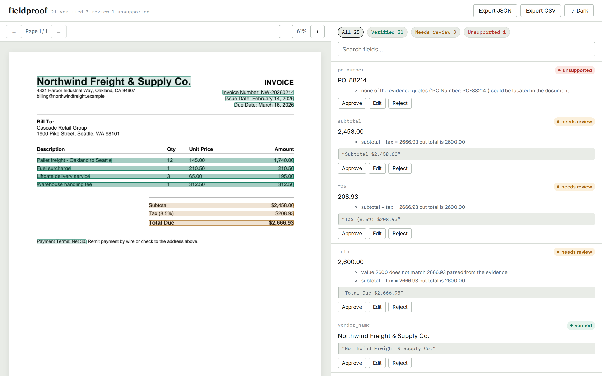
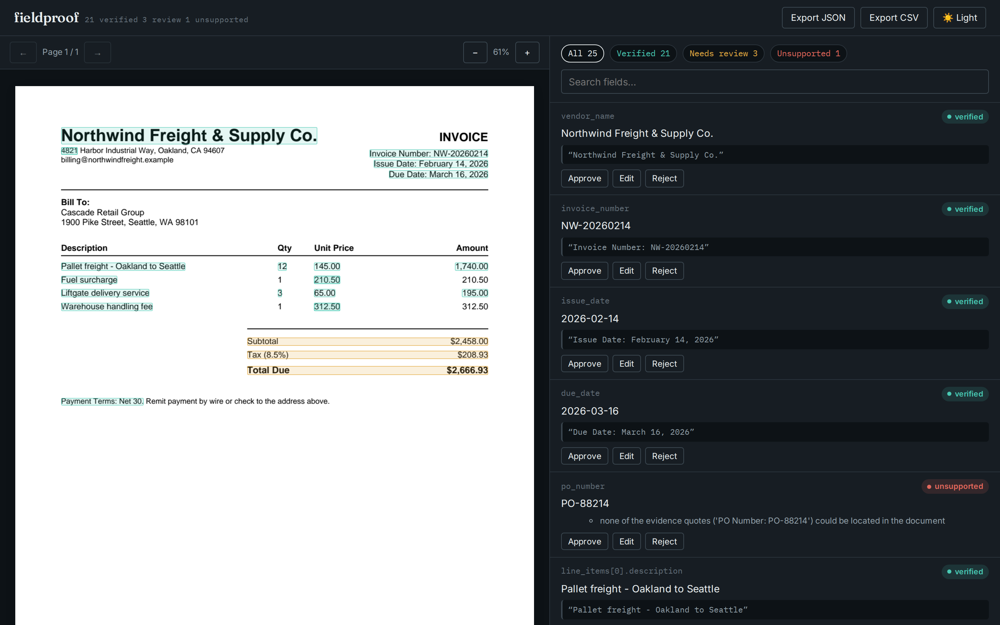
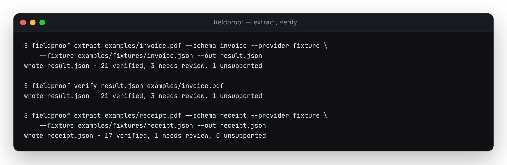
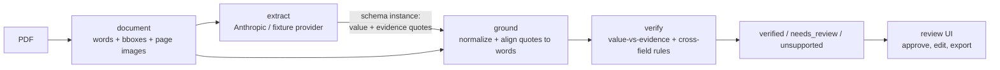

# fieldproof

**Document extraction that shows its work: every field linked to the exact words it came from.**

[](https://github.com/antonsoo/fieldproof/actions/workflows/ci.yml)
[](LICENSE)
[](https://antonsoo.github.io/fieldproof/)

LLMs are good at pulling structured data out of invoices, contracts, and forms.
In production the question is never "can it extract a total" - it's "can I trust
*this* total, on *this* document, without a human re-reading the whole page."
Most extraction pipelines give you a JSON blob and a confidence number pulled
out of nowhere. fieldproof instead makes the model cite a verbatim quote for
every field, locates that quote on the page with word-level bounding boxes,
checks that the quote actually supports the value it's attached to, runs
cross-field arithmetic and date-ordering checks, and gives a human a review UI
to confirm or fix whatever's left. Every field ends up `verified`,
`needs_review`, or `unsupported` - never a bare number with no way to check it.



<details>
<summary>Dark mode</summary>



</details>

## Live demo

**[antonsoo.github.io/fieldproof](https://antonsoo.github.io/fieldproof/)** - three
synthetic sample documents (invoice, receipt, contract), pre-extracted and
pre-verified by the real Python pipeline. The candidate extractions are
fixtures with deliberately planted errors - a hallucinated PO number, a total
that doesn't match its line items, and a misread date - so you can see exactly
what the verifier catches. No backend: the demo runs entirely on precomputed
JSON and static page images.

## Quickstart

The sample documents used below live in the repo (`examples/`), so this
clones it rather than installing blind from the registry-less package alone:

```bash
git clone https://github.com/antonsoo/fieldproof && cd fieldproof
pip install -e .
fieldproof extract examples/invoice.pdf --schema invoice --provider fixture \
  --fixture examples/fixtures/invoice.json --out result.json
```

`--provider fixture` replays a stored JSON extraction (no API key needed,
useful for CI/offline). To extract with Claude instead, set
`ANTHROPIC_API_KEY` and pass `--provider anthropic`. To review the result in
the browser instead: `fieldproof serve` (see [Development](#development) for
building the UI first).

## Features

- **Grounded extraction** - every field is `{value, evidence, page}`, not a
  bare value. Built-in Pydantic templates for invoices, receipts, and
  contract key terms; bring your own schema and it works the same way.
- **Provider-agnostic** - an `Extractor` protocol with an Anthropic
  (Claude) implementation using structured outputs, and a fixture provider
  for tests, CI, and offline demos.
- **Real grounding, not string search** - exact match first, rapidfuzz-based
  fuzzy alignment as a fallback, tolerant of curly quotes, ligatures,
  hyphenated line-wraps, and OCR noise. Maps back to word bounding boxes and
  merges them into per-line highlight rectangles.
- **Verification, not just a confidence score** - numbers, dates, currency,
  and strings are independently re-derived from the matched evidence and
  compared to the claimed value; line items are checked against subtotal,
  subtotal + tax against total, and due date against issue date.
- **A review UI that shows the reasoning** - click a field to jump to its
  evidence on the page; hover a highlight to see which field it supports;
  approve, edit, or reject; export approved values as JSON or CSV.
- **Optional OCR** - scanned PDFs fall back to Tesseract if it's installed;
  documented as a degraded mode, not silently pretended to be as reliable as
  a native text layer.

## Usage

### CLI

```bash
fieldproof extract doc.pdf --schema invoice --provider anthropic --out result.json
fieldproof verify result.json doc.pdf   # re-ground/re-verify an existing extraction
fieldproof serve --port 8000            # API + review UI
```

Real output, captured from this repo's sample documents:



### As a library

```python
from fieldproof.document import load_pdf
from fieldproof.schemas import Invoice
from fieldproof.extract import FixtureExtractor
from fieldproof.verify import verify

document = load_pdf("examples/invoice.pdf")
result = FixtureExtractor(fixture_path="examples/fixtures/invoice.json").extract(document, Invoice)
report = verify(result.data, document)

for field in report.fields:
    if field.status != "verified":
        print(field.path, field.status, field.reasons)
# po_number unsupported ["none of the evidence quotes (...) could be located in the document"]
# subtotal needs_review ['subtotal + tax = 2666.93 but total is 2600.00']
# tax needs_review ['subtotal + tax = 2666.93 but total is 2600.00']
# total needs_review ['value 2600 does not match 2666.93 parsed from the evidence', ...]
```

### Bring your own schema

Any Pydantic model built from `Evidenced[T]` leaves works - `fieldproof.ground`
and `fieldproof.verify` walk it generically (`iter_evidenced_fields`), they
never reference `Invoice`/`Receipt`/`ContractKeyTerms` by name:

```python
from pydantic import BaseModel
from fieldproof.schemas import Evidenced

class PurchaseOrder(BaseModel):
    po_number: Evidenced[str]
    approved: Evidenced[bool]
    amount: Evidenced[float]
```

Cross-field rules (line-item sums, date ordering) are schema-specific and
currently only implemented for the built-in Invoice/Receipt templates - see
[Limitations](#accuracy-and-limitations).

### Bring your own extractor

`Extractor` is a structural protocol (`def extract(self, document, schema) ->
ExtractionResult`) - implement it against any provider and
`fieldproof.ground` / `fieldproof.verify` work unchanged, since they only
depend on the `Evidenced` shape, not on Anthropic.

## How it works



**Trust is established in four steps**, and a field is only `verified` if all
four hold:

1. **Quote.** The model must produce a verbatim substring for every value
   (`fieldproof.extract.anthropic_provider` instructs this explicitly and
   uses structured outputs so it's enforced by the schema, not just asked
   nicely). No quote -> `unsupported` immediately; no need to even look at
   the page.
2. **Alignment.** `fieldproof.ground` normalizes both the quote and the
   page text (NFKC, straight quotes/dashes, collapsed whitespace) and tries
   an exact substring match first, falling back to
   [rapidfuzz](https://github.com/rapidfuzz/RapidFuzz)'s partial-ratio
   alignment (`fuzz.partial_ratio_alignment`) for the best-scoring substring
   of the page. Below a 70/100 score, the quote is treated as not found; a
   match under 92/100 is flagged as weak evidence even if it's found. The
   matched span is mapped back through an index map to the exact words it
   covers (via each word's character offset into the page's flattened
   text), and those words' bounding boxes are merged into per-line
   highlight rectangles.
3. **Value check.** The claimed value is independently re-derived from the
   *matched* evidence text - not trusted just because a quote was found
   nearby - and compared: numbers are parsed with currency/thousands-
   separator handling (and prefer the last non-percentage number in the
   evidence, e.g. `"Tax (8.5%) $208.93"` correctly reads `208.93`, not
   `8.5`), dates are parsed from either ISO-8601 or a handful of common
   formats and compared as calendar dates, strings use fuzzy partial-ratio
   (a short value inside a longer quote should still match), booleans look
   for yes/no/confirmed/denied language. Any mismatch -> `needs_review`.
4. **Cross-field rules.** For invoices and receipts: line items must sum to
   the subtotal, subtotal + tax must equal the total (both within a $0.02
   tolerance), and the due date must not precede the issue date. A failed
   rule marks every field it involves as `needs_review` and records why.

### Grounding quality, checked against ground truth

`tests/test_ground.py` and `tests/test_e2e.py` don't just assert "no
exception" - they assert exact match scores and exact reasons against
documents with known content: an exact quote must score 100, a quote with a
dropped colon and a curly apostrophe must score ≥85 but not be flagged
`is_exact`, a quote spanning a hyphenated line-wrap
(`examples/invoice.pdf`'s line items) must still ground at ≥80, and a quote
that's genuinely absent must return no match at all rather than a low-quality
one. `tests/test_e2e.py` runs the full pipeline against the checked-in sample
documents and pins down exactly which field each planted error is expected to
surface as - a regression that stops catching the hallucinated PO number or
the misread date fails a test, not just a manual look at the demo.

### Performance

Measured on this machine (14 vCPU, 48 GB RAM, WSL2 Linux), 200-iteration
average, on `examples/invoice.pdf` (25 leaf fields across 4 line items):

| Stage | Time |
|---|---|
| PDF text-layer load (pdfplumber) | 22.6 ms |
| Grounding + verification, all 25 fields | 4.3 ms |

Extraction time is dominated by the provider's network round trip, not
anything in this repo.

## Accuracy and limitations

- **OCR is a degraded mode, not equivalent to a text layer.** Scanned PDFs
  are supported only if the optional `ocr` extra (`pytesseract` + a system
  Tesseract install) is present; grounding still fuzzy-matches against
  whatever text Tesseract produced, but OCR accuracy drops sharply on
  skewed scans, low contrast, or unusual fonts, and word boxes are
  per-word pixel boxes with no sub-word offsets. Treat an OCR'd document's
  results as "Tesseract thinks this is what's there," not ground truth.
- **Tables aren't structurally parsed.** Line items are extracted by the
  LLM reading the page text in reading order, not by detecting table
  cells/columns - a table with an unusual layout (merged cells, multi-line
  cells, columns that don't read top-to-bottom-then-left-to-right) can
  confuse the model's reading of which number belongs to which row, even
  though each individual value's grounding is still checked independently.
- **No handwriting support.** Neither the text-layer path nor the OCR
  fallback is designed for handwritten text.
- **Cross-field rules are schema-specific.** They're implemented for the
  built-in Invoice and Receipt templates only
  (`fieldproof.verify.cross_field`); a custom schema gets grounding and
  value-vs-evidence checks but no arithmetic/date-ordering rules unless you
  add your own.
- **String matching is fuzzy by design**, which means a sufficiently short
  or generic value can occasionally find a spurious match inside unrelated
  evidence text. The 92/100 "strong match" threshold and the independent
  value check are there to catch most of this, but neither is a proof.
- **The Anthropic adapter is unit-tested against a mocked client only** -
  there's no API key configured in this repo's CI, so no test exercises a
  live model response; correctness of the live path depends on the model
  actually following the evidence-quoting instructions in the system
  prompt, which is a real-world behavior, not something a mock can verify.

## Architecture

```
src/fieldproof/
  document/   PDF loading (pdfplumber), page rendering (pypdfium2), optional OCR (pytesseract)
  schemas/    Evidenced[T], the generic field walker, Invoice/Receipt/ContractKeyTerms
  extract/    Extractor protocol, Anthropic provider, fixture provider
  ground/     text normalization, exact/fuzzy quote alignment, bbox merging
  verify/     value-vs-evidence checks, cross-field rules, the verdict engine
  server/     FastAPI app (upload, extract, review, export)
  cli.py      extract / verify / serve
web/          Vite + TypeScript review UI (no framework)
scripts/      synthetic sample-document generator, static-demo data precomputation
examples/     synthetic sample PDFs + fixture extractions (planted errors, for the demo/tests)
```

Python ≥3.11, [uv](https://docs.astral.sh/uv/) for dependency management,
src layout, fully typed (`mypy --strict`-adjacent; see `pyproject.toml`).

## Development

```bash
uv sync --extra dev --extra ocr
uv run pytest
uv run ruff check src tests
uv run mypy src

cd web && npm ci && npm run typecheck && npm run lint && npm run build
```

Regenerate the sample documents and demo data after changing them:

```bash
uv run python scripts/generate_samples.py
uv run python scripts/build_demo_data.py   # writes web/public/demo-data/ (gitignored, built at Pages deploy time)
```

## Contributing

See [CONTRIBUTING.md](CONTRIBUTING.md). Issues and pull requests welcome.

## License

[MIT](LICENSE) © 2026 Anton Soloviev
